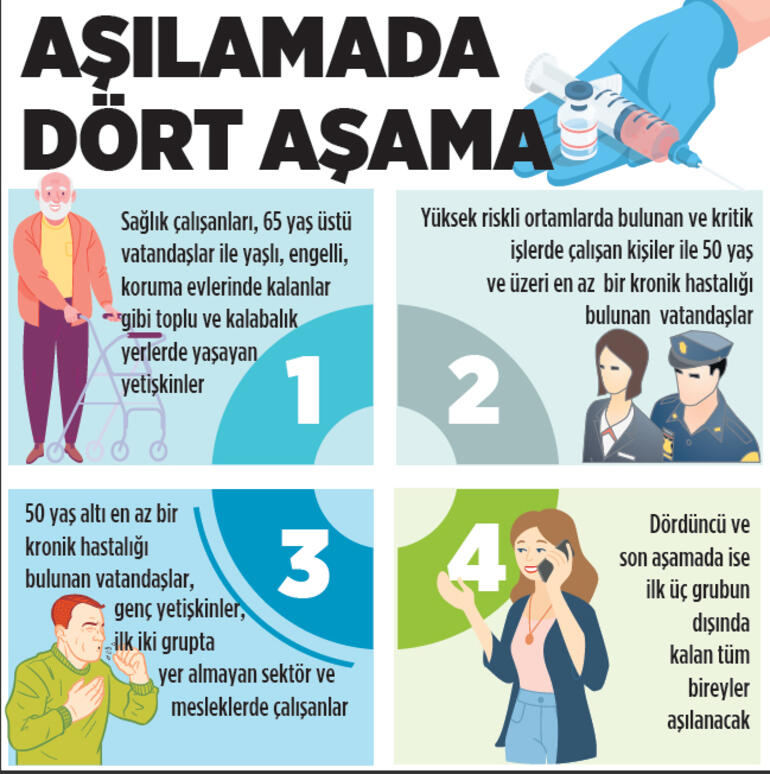

# Hangi aşı grubundayım?💉

Bu uygulama, ülkemizde gelecek günlerde yapılacak Covid-19 aşılaması için vatandaşların hangi sırada aşı olacağını tahmin eder.

  
   
  <em><a href="https://www.milliyet.com.tr/gundem/2-asilama-polis-asker-ve-ogretmenlere-6370907">4 Adımda Aşılama</a></em>

> <a href="https://hangiasigrubundayim.com">hangiasigrubundayim.com</a> kişilerin aşılama grubunu haber kaynaklarından alınan verilere göre tespit eder.

> ***Sağlık bakanlığı'nın yapacağı resmi açıklamanın ardından grup hesaplama algoritması güncellenecektir.***

Projeye katkıda bulunmak isterseniz [PR](https://github.com/batin/hangi-asi-grubundayim/pulls) atabilirsiniz.

